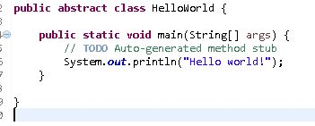
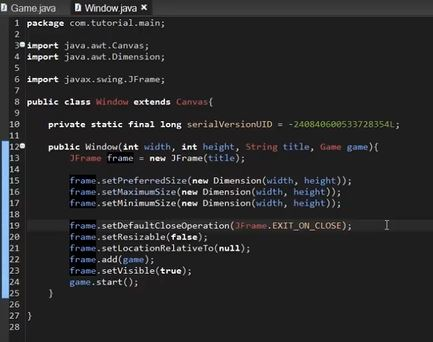

# Jumping in head on! #

Starting off week two I decided that i need to make progress posthaste! So I downloaded eclipse and started to test out code I found online only to be completely confused with how the program actually functioned, And with uncertainty that what i was doing was effective. So I decided that I need to do more research: first understanding eclipse, then to watch a video guide on how to apply java to create video games, third to finish codecademy lessons, and finally to create my own piece. So now my plan was set, ill leave links to show what I studied.

 
https://www.youtube.com/watch?v=1gir2R7G9ws

https://www.codingmadesimple.com/courses/

https://www.codecademy.com/courses/learn-java

# understanding eclipse #
http://help.eclipse.org/oxygen/index.jsp?nav=%2F0

I did some digging on the official website, and I ended up finding an official documentation providing in depth details on how to use the program. From what i was able to gather after reading the basics and doing a tutorial on how to create a hello world program. I ended up discovering that classes are required in order to make something work. 

This gave me two emotional responses, one being “Its like ruby's object orientation! Im familiar with this!”and the more negative “It's like ruby's object orientation……. Which im terrible at...” 

Yet i'm not discouraged by this! I can at least learn this again at my own pace this time, instead of rushing through certain aspects. Besides I found another teaching service linked above that i will try soon!

# lessons from the academy #
I started codecademy with already familiarity with javascript, I noticed many familiarities between all the languages that i've used. Such as If else statements.
<pre><code>if (7 <= 7) {

			System.out.println("Try again...");

		} else {

			System.out.println("Success!");
		}
</code></pre>
However there are new things that i've never seen before such as switch statements.
<pre><code>int restaurantRating = 3;

switch (restaurantRating) {

    case 1: System.out.println("This restaurant is not my favorite.");
      break;

    case 2: System.out.println("This restaurant is good.");
      break;

    case 3: System.out.println("This restaurant is fantastic!");
      break;

    default: System.out.println("I've never dined at this restaurant.");
      break;
}</code></pre>
A switch statement from my understanding is Javas alternative way to use conditional statements that and  way to execute a code block not based on a boolean, but rather based on whether or not the block is equal to a specific value. A little confusing still? 

Well let's look at it like this: You have a variable equal to some value. Then you have, lets say 3 alternate outcomes of that variable if its value is changed to another specific value, these are known as cases. Then say that out of those 3 values none of them are chosen when your variable is saved. In short this is where the default case is used, this case is a sort of safety net so your program does not crash.it is a very useful. 

For example the variable could be a value a player controls and thus the different cases represent different actions, the default is used just in case the player does an impossible action. Try to see if you can find your own understanding if mine was unclear.
# Video review #
Watching the first video of “Java Programming: Let's Build a Game #1” has already showed me a framework on what I should start with in terms of starting off my game development. Its complex but from what I can understand its almost identical to creating a canvas in javascript. Familiarity is good!
See below for pic of starting framework.

From this the narrator describes what a Jframe is: in short a Jframe is the actual window of our game, it is inessence our very own playground for testing our game. The narrator then goes on to talk about frame.setDefaultCloseOperation(JFrame.EXIT_ON_CLOSE);

<pre><code>frame.setDefaultCloseOperation(JFrame.EXIT_ON_CLOSE);</code></pre>

This line of code ensures that once the user exits the window or presses a key on the computer that is assigned to exit the game, the game will stop running and end its processes.

### After watching the first episode. ###

The first episode Comes with the starter code to create a game! It is very lengthy and is full of things i'm not too sure about, however I am confident that this is the perfect way to start game development. Continuing from this I am not sure on what to make yet, though I am Eager to what I can think of.

# Takeaways #

* <strong>First find a teaching service to familiarize yourself with the material

* Next find a video guide to help clear up some conflicts and uncertainties you may have

* Then test out what you've learned in a code editor

* finally remind yourself that time is limited, don't procrastinate 

</strong>

