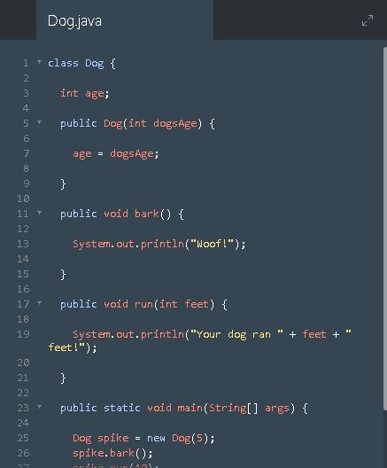
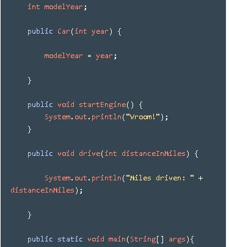
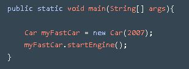

# Slowly Understanding #
Starting this week off I watched more of the video tutorial, I also did more lessons on codecademy, as well as looking for more tips for java development.

# Video lessons  #

 The backend of a videogame is the most important part since without the backend, you simply cannot create the frontend. It's as if you wouldn't be able to use html unless you had CSS first. 

Here is a handler class, which in turn updates and renders all objects within our game.

Here protected is used because it offers a way for our game objects to only interact with these x and y coordinates.

# Lessons from the academy: #

As I continued Code academy. I saw that much of it was ruby concepts but with java syntax. So from this I can conclude that ruby and java are both very similar. Seeing how methods and classes are used functionally the same, I felt that this section of code academy has been a review in a way.

Here are some examples of what I mean.

# Tips: #

So since i'm starting to think about how I need to create my game, I thought searching up some tips would be useful. Specifically for java development, so i found the top 4 that I feel are the most useful

### 1. Make sure you get the basics right ###

Master the basics of java before doing anything reckless.. As a result of being reckless, you would only get ‘bits and pieces’ of  knowledge as well as a few options that Java offers, but basics hang on a loose thread. Java is one programming language which is easy if you have paid attention to the simple basics, however; it can be frustrating if you get greedy and try to take the shorter route forward.

### 2. Understand your code and algorithms ###

Start by realizing the code on a piece of paper(or as Mr. Mueller calls it, Pseudocode). The algorithm and the compiler process will look very meaningful once you understand the idea behind the code. The best way to solve a complex problem or to formulate an algorithm  to solve a Java program is to break the problem into portions and then try to devise a solution for each part. 

### 3. Do not forget to allocate memory ###

The memory allocation in Java using the ‘new’ keyword is a necessity as Java is a dynamic programming language. Therefore you must take care while handling array and object declaration in Java. Not using the ‘new’ keyword will show a null pointer exception in the code.

### 4. Avoid creating useless objects ###

When you create an object in Java, you use up memory and processor speed from the system. Since object creation is incomplete without allocating memory to it, it is better to keep the object requirements under check and not create unwanted objects in the code.

I will be Keeping these in mind for when I code my MVP for my Java project.

# Takeaways: #

1. Reviewing concepts within new syntax broadens understanding
2. Avoid Creating useless Objects since it takes up memory and storage
3. Pseudocode is a very useful practice for MVP development and can solve a multitude of problems(Wish I understood this sooner)
4. 

