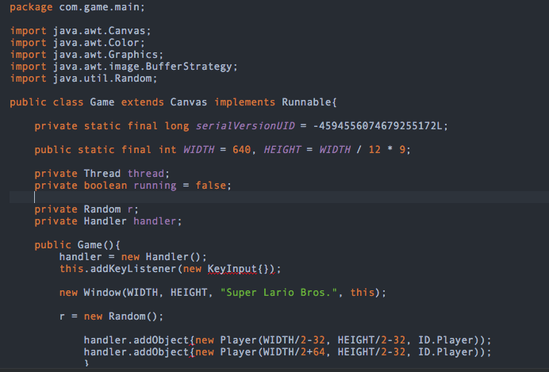
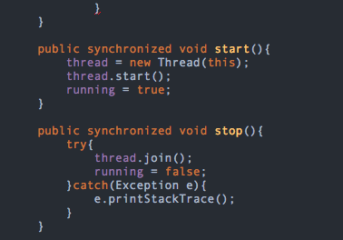
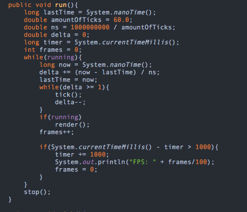
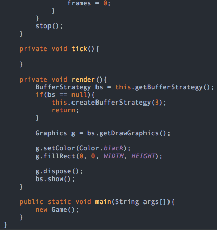
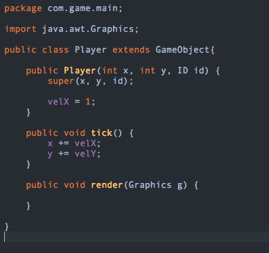
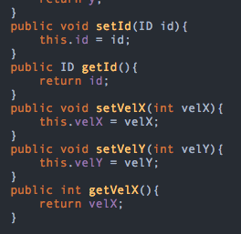
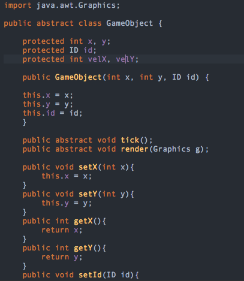
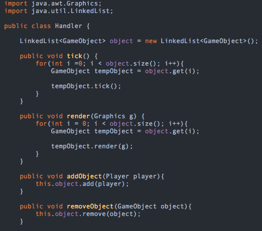
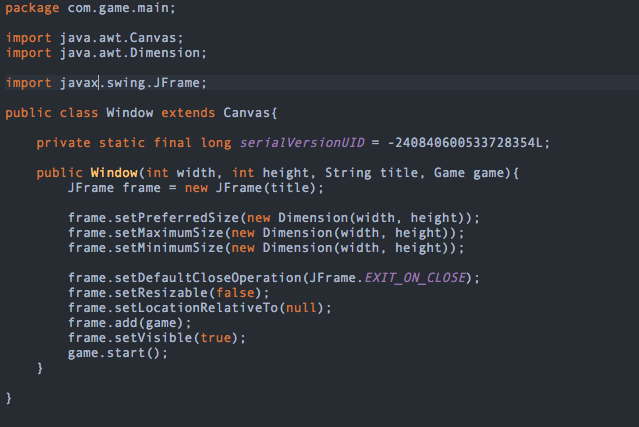

# Trying what Ive learned #

This week I mainly focused on working though the video tutorials and being able to create a program that works well within eclipse. I’ve been feeling good about but have nothing to show for it at this time. So I decided that I will show everyone next week what I have created.