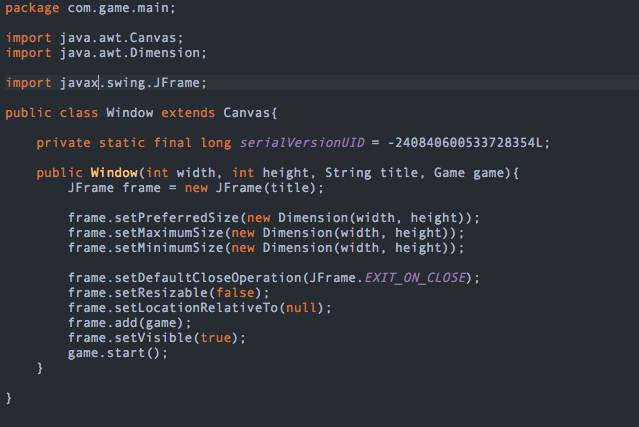
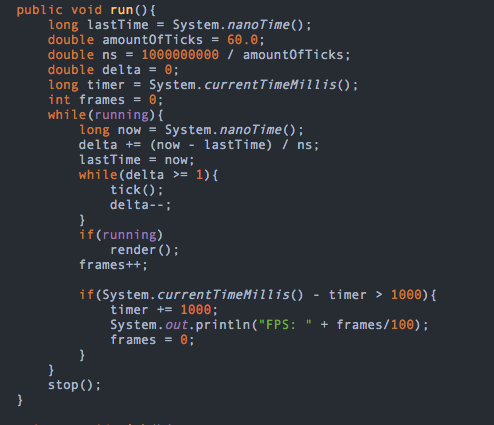
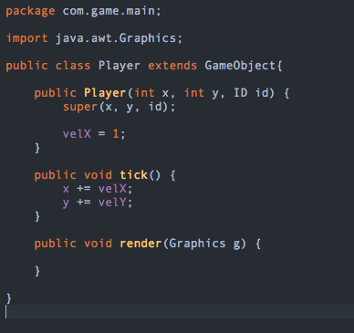

# Creating Super Lario Brothers #
Note ALL code screenshots are from my own personal Codeenvy if need be, proof can be provided.

During week 4 we decided what our project will be called, and then we created an MVP for our project, Thusly named our new project Super Lario Brothers. 

We started off getting starter code, since none of has had made a java based game before, we needed to start somewhere.  So we consulted the video tutorial for our base code.

The top image shows what will create the window of our game, rendering what we will create. The window itself is customized to be a set width and height, as well as having a specific color, spawning at the center of the screen when generated and  even stopping the game from continually running even when the window is closed. This portion is crucial! 

The images below this one are what the in game time is, not to be confused with a timer. The system below is the tick speed of our game; it simply is the flow of time from when the game begins running. You may ask "WHY WOULD THIS BE USEFUL IN ANY CAPACITY SIMEON??!!" Well it’s useful because we need our game to update and render itself every frame it is active. The code bellow helps this process since it tracks every second or 'Tick' that passes and the game therefore has a function to retrieve this information from.

The image below represents the player object in our game. The object itself represents what the player can do and where players velocities will be, another detail to point out would be the fact that the player also has graphics, just not yet implemented.

 
 
 

This class represents all game objects and when attached to another function, that function is now shared with this class. The benefits of having this are to differentiate what is the player, what the enemy is, and what is a coin/other object. In short this helps separate objects and provides efficiency in code.

# Takeaways #
tips to remind myself
1. Do not have useless functions within your code, that wastes rendering space
2. seperate gameobjects accoringly, diffrentiating betwwen player, enemy, coin, etc.
3. window width and height should stay set  to avoid any complications in HUD
