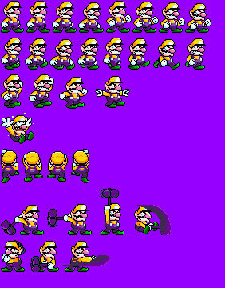
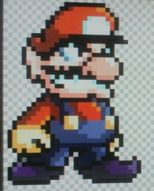
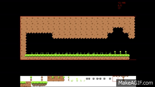

# Game Development is on! #

Finally we are progressing smoothly with Super Lario Bros!

We ended up working on sprites and tile maps as the days went on. We created our first level, a sprit set for our hero lario, and a few music ideas. We cannot wait to show you our progress.

# Sprites for Lario #

We wanted lario as our character because me and my friend have this inside joke that he is Lario. So in essence this demo is about him. 

We started out by not having any idea on how our hero would look like. Sure we had a name but we had no idea what he could be. So we did what we could do, create a Wario sprite that had Mario type clothing. 

See below for sprite reference

We started with a basic wario sprite then changed the colors around as our parody character.

His design isn’t final, however he will be finished in due time.

# Level 1-1 #

We created a first level with a tile set provided by a creative commons source. The tile map is our fundamental vision of what the first level will be. This tile map will be implemented once we have finished everything else required.

The level is fairly basic, no enemies have yet been provided and we are making slow but efficient progress. 
Hopefully once our MVP is complete, we can retrieve other assets like a new tile set to have the game get its own feeling. 

# Takeaways # 

1. Find a tile set that’s unique to use for the feel of your game. Either create your own or Google a free one to use. 
2. Sprites can be tough to find so hope that you can find free ones that aren’t copywriter, this is crucial.
3. When building a level, make sure you don’t create an impossible layout that fails upon test. Start simple then work your way up.
