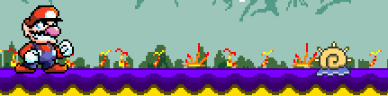
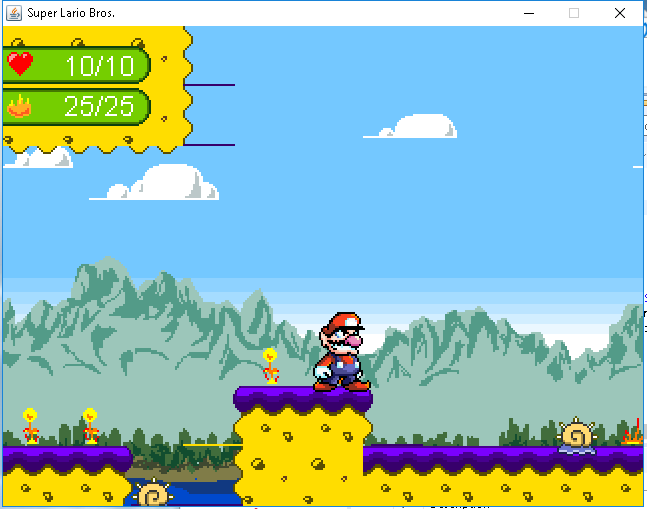
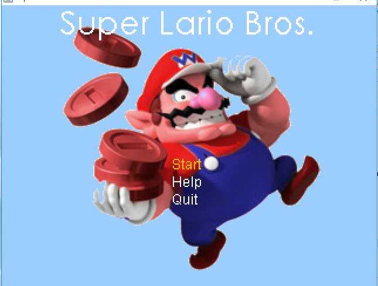

# Developer Hell with sprites #

During our time working and finalizing our MVP we encountered many issues with our player sprite. It seemed that whatever we did to try and fix our player sprites lead to a jumbled mess of our character. In truth he looked as if he was phasing in and out of reality, to combat this dimensional error we ended up changing the players width and height respectively to the sprite.  From 30 width 40 height to an even 60 X 60 sprite. 

Now we got something a bit better. However we ended up having other issues specifically with both attacking animations. Leading Lario (the player sprite) to crunch horizontally in size when he decided to swing his hammer towards the left. Still we were determined to continue fixing these issues. 

# Additions with decisions #

We added in our own music, title screen, tile set, a whole other level for a second transition, and we are thinking about a second character to adopt into our game. 

Our second level is decided to be a temple, unable to find a tile set that works with our game I decided to take it upon myself and create my own tile sheet by using our previous one and making edits from that. From this I created a new tile sheet by taking assets from others that were not compatible with our tile editor, This in turn worked well. 

# Takeaways #

Through thick and thin we managed to create our MVP and from our time starting our work on Friday at 4:00 pm to 12:00 pm on Saturday, we managed to create something we are very proud of. 

1. Make sure your sprites fit with the game
2. Make sure that your sprites animations work together well
3. Don’t use pointless programs that will hinder your overall progress
4. Pngs work better then gifs