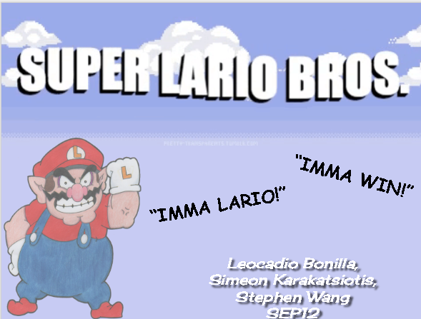

# Reflection #

Starting Java in the beginning was a challenging process, having to watch so many tutorials, adjusting code, fixing sprite hell, learning abstract concepts, and finding a way for a simple window to form. It was a lot of work that we can say paid off; our struggles with our trials and tribulations lead me to rethink my opinion of software development. Originally my opinion was that coding is powerful, however it seemed unreasonably annoying with syntax as well as not understanding how to translate my ideas into code, I was frustrated. I disliked code because it didn’t make me proud to continue it. Then Mr. Mueller proposed working on a project on whatever I wanted to do. “Do whatever I want?! Anything?!” it seemed like the perfect opportunity to make a game, taking from my past as a young child I knew that I wanted to make a game based on my favorite video game series, Super Mario Brothers. This really excited me since I met my partners who provided me with the support and help I needed to create this challenge. Determined, I, Stephen Wang, and Leo Bonilla started our work. I learned how to use java unlike any other coding language and I began to realize what java did to change my idea of what programming means. Java essentially taught me that software development isn’t entirely about making the next big app to get money and be famous. Software development is about expressing your dreams to make something from your imagination that will positively affect people, by expressing your creativity and to change the world with that idea. 

# The Future #

Then as I look towards the future, I can see myself working on this game and continuing its development by adding bosses, new enemies, new stages, a lot of tweaking sprites, and so much more. Super Lario Bros will continue to inspire me as what I did seemed truly unreal, maybe I may find some interest in progressing my java knowledge even further in college. Not entirely sure, but we shall see. 

